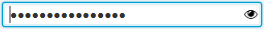
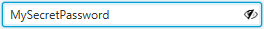

# PeekablePasswordField
A JavaFX PasswordField that supports unmasking ("peeking") the typed charachters.  
This component can be used as a replacement for the standard JavaFX PasswordField when the possibility to see the typed charachters is desired.  
The component shows a little eye icon on the right and when the user holds the mouse pressed on the icon the typed characters are revealed; as soon as the users releases the mouse or moves it away from the eye icon, the password is masked again.  
To have it available in SceneBuilder just put the jar in the custom library folder.  
Masked:  
  
Unmasked:  
  
